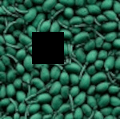
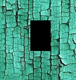
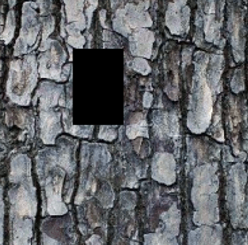
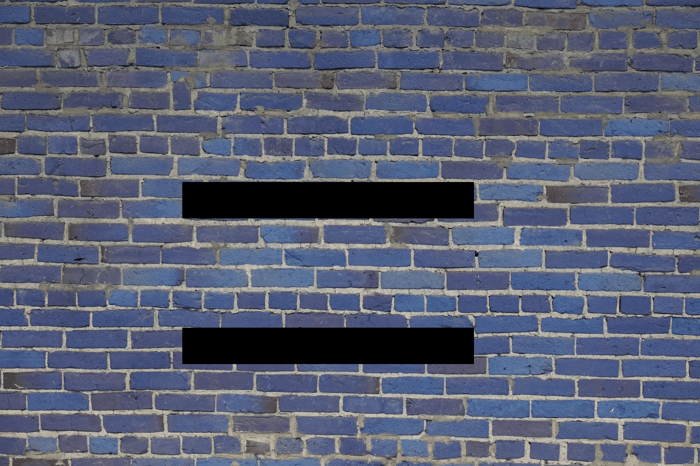

# patch-based-texture-inpainting

Based on "Image Quilting for Texture Synthesis and Transfer" and "Real-Time Texture Synthesis by Patch-Based Sampling" papers and from the implementation of anopara https://github.com/anopara/patch-based-texture-synthesis.

## Installation
```
pip install patch-based-inpainting
```

## Usage
[Documentation](https://patch-based-texture-inpainting.readthedocs.io/en/latest/)

```
    The Inpaint object contains will performed patch-based inpainting.
    Usage: create the object with parameters, call object.resolve().

    Parameters
    ----------
    image : array
        The image to inpaint.
    mask : array
        The mask of the same size as the image, all value > 0 will be inpainted.
    patch_size : int
        The size of one square patch.
    overlap_size : int
        The size of the overlap between patch.
    training_area : tuple
        The rectangle (x, y, width, height) of the area for the training. If None will use all the image.
    window_step : int
        The shape of the elementary n-dimensional orthotope of the rolling window view. If None will be autocomputed. Can lead to a RAM saturation if to small.
    mirror_hor : bool
        Compute the horizontal mirror of each patch for training.
    mirror_vert : bool
        Compute the vertical mirror of each patch for training.
    rotation : list
        Compute the given rotations in degrees of each patch for training.
    method : str
        Method to use for blending adjacent patches. blend: feathering blending ; linear: mean blending ; gaussian: gaussian blur blending ; None: no blending.
```


## Example






