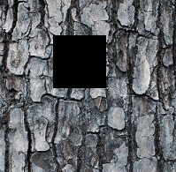
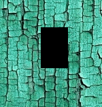

Welcome to patch-based-inpainting's documentation!
==================================================

Image inpainting based on "Image Quilting for Texture Synthesis and Transfer" and "Real-Time Texture Synthesis by Patch-Based Sampling" papers.

.. image:: ../../assets/1.gif

.. autoclass:: patch_based_inpainting.inpaint.Inpaint
    :members:

.. toctree::
   :maxdepth: 2
   :caption: Contents:

Indices and tables
==================

* :ref:`genindex`
* :ref:`modindex`
* :ref:`search`
